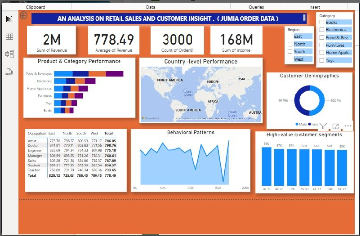
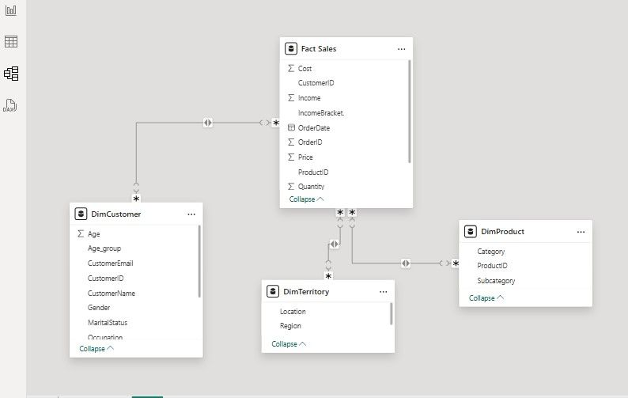

# 📊 Jumia Order Data Analysis

**Domain:** Business Analytics

**Tools:** Microsoft Excel • Power Query • Power BI • DAX

Transforming raw sales data into actionable business insights through interactive dashboards and data storytelling.

---

# 📸 Dashboard Preview

> 📌 Replace the image below with your dashboard screenshot after uploading it to the **Images** folder.



---

# 📖 Project Overview

The Jumia Order Data Analysis project explores customer purchasing behavior, product performance, and regional sales trends using transactional sales data. The project transforms raw order data into meaningful business insights through data cleaning, modeling, interactive dashboards, and storytelling to support data-driven decision-making.

---

# 🎯 Business Problem

E-commerce businesses generate large volumes of transactional data every day, but without proper analysis, valuable insights remain hidden. This project aims to identify the products, customer segments, and regions driving sales performance while uncovering opportunities to improve revenue, customer engagement, and strategic decision-making.

---

# ❓ Business Questions

This project answers the following business questions:

- Which products and categories generate the highest revenue?
- Which customer segments (age, income, and region) drive the most sales?
- How does spending vary across occupations and regions?
- Is there a relationship between quantity sold, product price, and customer income?
- Which product categories perform best across different countries?
- Are there significant differences in spending between male and female customers?

---

# 📂 Dataset Description

| Attribute | Description |
|------------|-------------|
| Dataset | Jumia Order Data |
| Domain | Business Analytics |
| Records | 3,000 Customer Orders |
| Data Type | Transactional Sales Data |
| Source | Sample E-commerce Dataset |

---

# 🧹 Data Preparation

The dataset was prepared through the following steps:

- Removed duplicate records
- Checked for missing values
- Corrected data types
- Created calculated columns
- Created income brackets
- Standardized category names
- Built a star schema data model
- Created DAX measures for KPIs

---

# 🏗 Data Model

A star schema was implemented to improve report performance and simplify analysis.

### Fact Table
- FactOrders

### Dimension Tables
- DimCustomer
- DimProduct
- DimTerritory
- DimDate

> 📌 Add your data model screenshot below.



---

# 📊 Dashboard Features

The dashboard provides interactive analysis of:

- 📦 Product Performance
- 🌍 Regional Sales Analysis
- 👥 Customer Segmentation
- 💰 Revenue Analysis
- 📈 Sales Trends
- 🛒 Category Performance
- 📊 KPI Monitoring

Interactive slicers allow users to filter the dashboard by region, age group, income bracket, occupation, product category, and country.

---

# 📌 Key Insights

- Food & Beverages, Electronics, and Furniture generated the highest revenue.
- The East and South regions contributed the largest share of total sales.
- Customers aged 30–50 accounted for the highest purchasing activity.
- Doctors and Students recorded the highest average spending per order.
- Mid-income customers (₦40,000–₦80,000) purchased larger quantities, while higher-income customers placed fewer but higher-value orders.
- Spending between male and female customers was relatively balanced, with differences mainly in product preferences.
- Orders priced between ₦1,000 and ₦2,000 represented the highest sales volume, highlighting an opportunity for bundled promotions.

---

# 💡 Recommendations

Based on the analysis, the following recommendations are proposed:

- Increase inventory for high-performing product categories.
- Develop region-specific marketing campaigns for East and South.
- Introduce loyalty programs targeting high-value customer segments.
- Bundle products within the ₦1,000–₦2,000 price range to increase average order value.
- Personalize marketing based on customer demographics and purchasing behavior.
- Expand high-performing product categories into underperforming regions.

---

# 📈 Business Impact

This analysis enables stakeholders to:

- Make data-driven business decisions.
- Improve inventory planning.
- Increase customer retention.
- Optimize regional marketing strategies.
- Enhance product pricing decisions.
- Identify profitable customer segments.
- Support revenue growth through targeted promotions.

---

# 🛠 Skills Demonstrated

## 📊 Data Analysis

- Exploratory Data Analysis (EDA)
- Data Cleaning
- Data Transformation
- Customer Segmentation
- Sales Performance Analysis
- Revenue Analysis
- KPI Development
- Trend Analysis

## 📈 Data Visualization

- Dashboard Design
- Interactive Reporting
- Data Storytelling
- Business Reporting

## 💻 Technical Skills

- Microsoft Excel
- Power Query
- Power BI
- DAX
- Data Modeling

---

# 📁 Repository Structure

```
Jumia-Order-Data-Analysis/
│
├── Data/
│   ├── Raw Data.xlsx
│   └── Cleaned Data.xlsx
│
├── Dashboard/
│   └── Jumia Dashboard.pbix
│
├── Images/
│   ├── dashboard-overview.png
│   └── data-model.png
│
├── Documentation/
│   ├── Business Questions.pdf
│   └── Project Report.pdf
│
├── README.md
├── LICENSE
└── .gitignore
```

---

# 🚀 Future Improvements

Potential enhancements include:

- Sales forecasting using machine learning.
- Customer lifetime value (CLV) analysis.
- Customer churn prediction.
- Automated dashboard refresh.
- Deployment to Power BI Service.
- Integration with live e-commerce data.

---

# 👩‍💻 About the Author

## Anita Okechukwu

**Healthcare Professional | Data Analyst | Aspiring AI Specialist**

I combine my healthcare background with data analytics to transform healthcare and business data into actionable insights that support informed decision-making. My portfolio showcases projects in Excel, SQL, Power BI, Python, Machine Learning, and Healthcare Analytics.

📧 **Email:** anitaokechukwu927@gmail.com

🔗 **GitHub:** *Add your GitHub profile link here*

💼 **LinkedIn:** *Add your LinkedIn profile link here*

🌐 **Portfolio:** *Add your portfolio website link here*

---

⭐ **If you found this project helpful, please consider giving it a star!**
